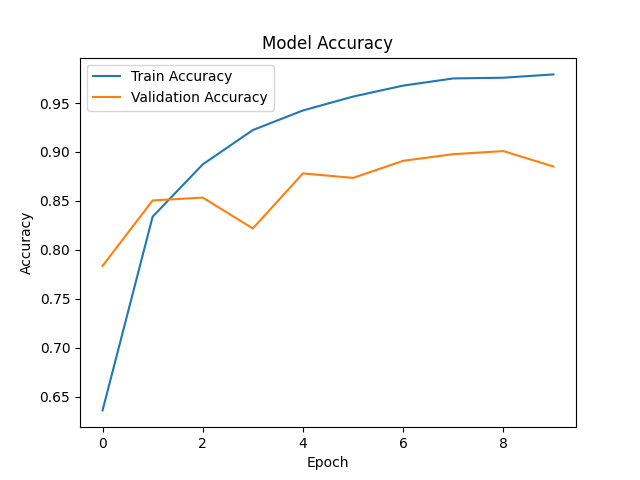
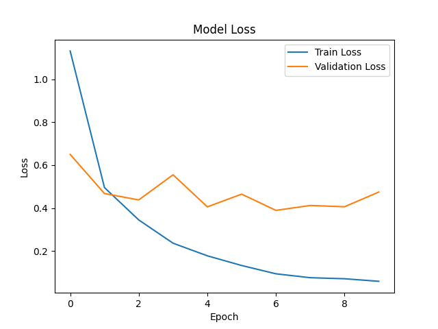
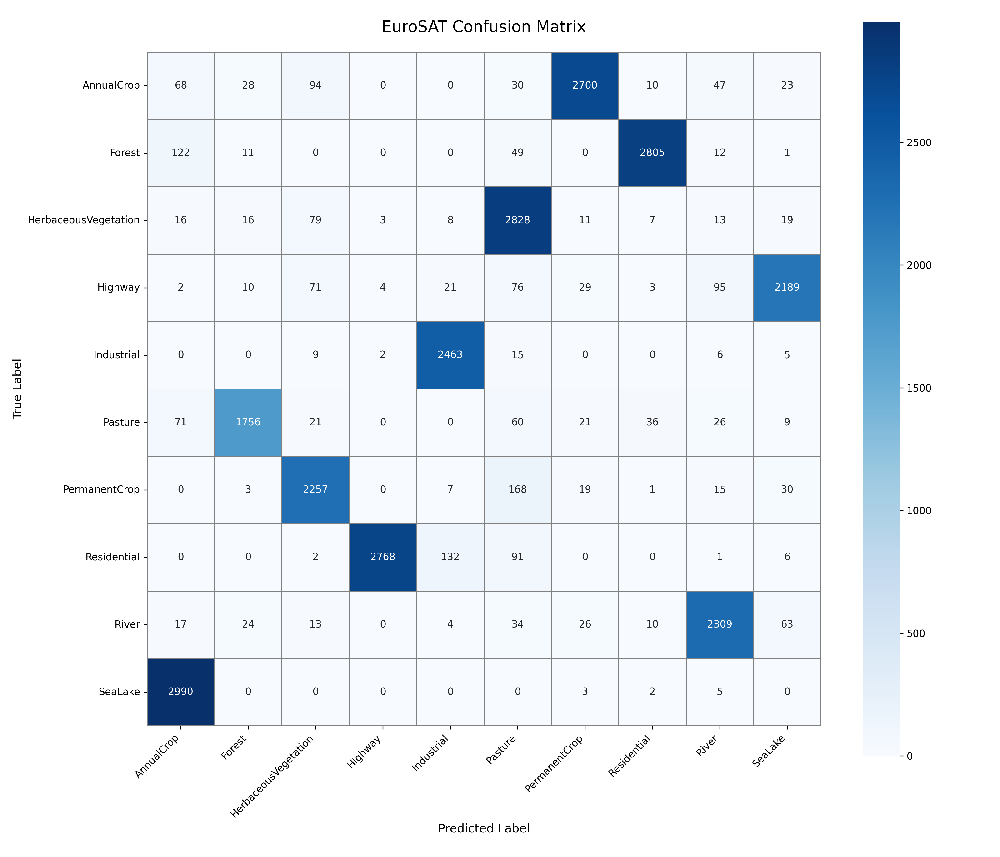
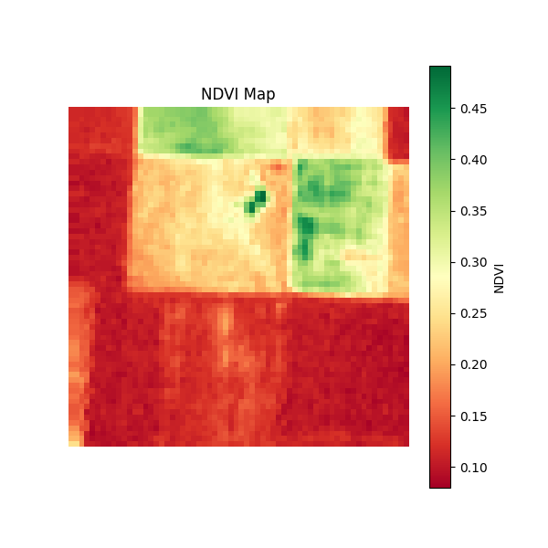
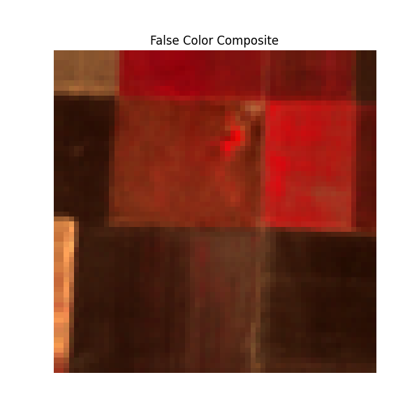
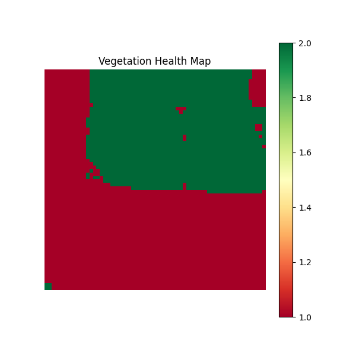

# Crop Type Classification and Vegetation Health Assessment Using Satellite Images

## Project Overview

This project uses **Sentinel-2 satellite imagery** and **Computer Vision techniques** to classify land cover and vegetation categories while assessing vegetation health through **NDVI (Normalized Difference Vegetation Index)** analysis.

The system combines:

- Satellite image classification using a Convolutional Neural Network (CNN)
- NDVI generation from multispectral satellite imagery
- False-color composite visualization
- Vegetation health assessment
- Performance evaluation using accuracy/loss curves and a confusion matrix

---

## Objectives

- Classify satellite imagery into different land-use and vegetation categories.
- Analyze vegetation health using Sentinel-2 multispectral bands.
- Generate visual outputs useful for agricultural monitoring.
- Demonstrate the application of Computer Vision in satellite image analysis.

---

## Dataset

### EuroSAT RGB

The RGB version of the EuroSAT dataset was used for CNN-based image classification.

**Dataset Characteristics**

- 27,000 labeled satellite images
- 10 classes
- RGB images
- 64 × 64 image size

Classes:

- AnnualCrop
- Forest
- HerbaceousVegetation
- Highway
- Industrial
- Pasture
- PermanentCrop
- Residential
- River
- SeaLake

### EuroSAT Multispectral (MS)

The multispectral dataset contains:

- 13 Sentinel-2 spectral bands
- 64 × 64 pixels
- TIFF format

Used for:

- NDVI generation
- False-color visualization
- Vegetation health assessment

---

## Technologies Used

- Python
- TensorFlow / Keras
- OpenCV
- NumPy
- Matplotlib
- Rasterio
- Scikit-learn
- Seaborn

---

## Project Structure

```text
crop-type-classification-cv/
│
├── models/
│   ├── crop_model.keras
│   ├── eurosat_model.keras
│   ├── eurosat_labels.npy
│   ├── eurosat_accuracy_plot.png
│   ├── eurosat_loss_plot.png
│   └── labels.npy
│
├── results/
│   ├── accuracy_plot.png
│   ├── loss_plot.png
│   ├── confusion_matrix.png
│   ├── ndvi_map.png
│   ├── false_color.png
│   └── vegetation_health_map.png
│
├── src/
│   ├── train.py
│   ├── predict.py
│   ├── evaluate.py
│   ├── ndvi.py
│   ├── ndvi_demo.py
│   ├── preprocessing.py
│   ├── model.py
│   ├── satellite_preprocessing.py
│   └── satellite_train.py
│
├── README.md
├── requirements.txt
└── .gitignore
```

---

## Methodology

### 1. Data Preprocessing

- Load EuroSAT RGB images
- Resize images to 64 × 64 pixels
- Normalize pixel values
- Encode class labels
- Split dataset into training and testing sets

### 2. CNN-Based Classification

A Convolutional Neural Network (CNN) is trained on EuroSAT RGB images.

Architecture:

```text
Input Image (64x64x3)
        ↓
Conv2D (32 Filters)
        ↓
MaxPooling2D
        ↓
Conv2D (64 Filters)
        ↓
MaxPooling2D
        ↓
Flatten
        ↓
Dense (128)
        ↓
Dense (10 Classes)
```

### 3. NDVI Generation

NDVI is calculated using Sentinel-2 multispectral bands:

```text
NDVI = (NIR - Red) / (NIR + Red)
```

Where:

```text
NIR = Band 8
Red = Band 4
```

### 4. Vegetation Health Assessment

NDVI values are categorized into:

| NDVI Range | Vegetation Condition |
|------------|---------------------|
| < 0.2 | Poor |
| 0.2 – 0.5 | Moderate |
| > 0.5 | Healthy |

---

## Training Results

| Metric | Value |
|----------|----------|
| Dataset | EuroSAT RGB |
| Images | 27,000 |
| Classes | 10 |
| Epochs | 10 |
| Final Accuracy | 82.19% |

---

## Accuracy Plot



The model accuracy improves steadily during training and reaches over 82% validation accuracy.

---

## Loss Plot



The loss decreases consistently during training, indicating successful learning.

---

## Confusion Matrix



The confusion matrix visualizes classification performance and class-wise prediction accuracy.

---

## NDVI Map



The NDVI map highlights vegetation density and health using Sentinel-2 spectral information.

---

## False Color Composite



False-color imagery improves vegetation visibility by mapping Near Infrared (NIR) information into the visible spectrum.

---

## Vegetation Health Map



Vegetation health categories are generated from NDVI values and visualized using color-coded regions.

---

## Sample Prediction

Example prediction result:

```text
Prediction: Forest
Confidence: 97.77%
```

The prediction module loads the trained model and classifies unseen satellite images.

---

## Installation

Clone the repository:

```bash
git clone <your-repository-url>
cd crop-type-classification-cv
```

Install dependencies:

```bash
pip install -r requirements.txt
```

---

## Training the Model

```bash
python src/train.py
```

---

## Running Predictions

```bash
python src/predict.py
```

---

## Generating NDVI Maps

```bash
python src/ndvi_demo.py
```

---

## Model Evaluation

```bash
python src/evaluate.py
```

---

## Applications

- Agricultural Monitoring
- Crop and Vegetation Analysis
- Vegetation Health Assessment
- Land Cover Classification
- Environmental Monitoring
- Remote Sensing Applications

---

## Future Improvements

- Real-time Sentinel-2 image integration
- Crop-specific classification datasets
- Advanced CNN architectures (ResNet, EfficientNet)
- Time-series satellite image analysis
- Web-based monitoring dashboard
- Geographic Information System (GIS) integration

---

## Conclusion

This project demonstrates how Computer Vision and Deep Learning techniques can be applied to satellite imagery for land-cover classification and vegetation health assessment. Using the EuroSAT dataset and Sentinel-2 multispectral data, the system successfully performs image classification, NDVI generation, false-color visualization, and vegetation health analysis.

---

## Author

**Charith Manujaya**

---

## License

This project is developed for academic and educational purposes.
